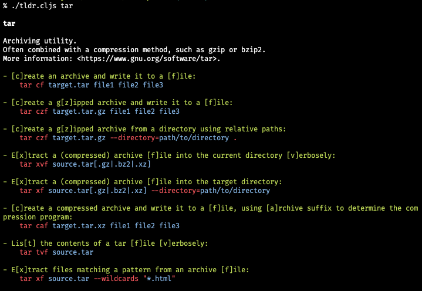

# tldr-planck

A [TLDR pages](https://tldr.sh/) client written in Planck (Stand-alone ClojureScript REPL)



## Requirement

[Planck](https://planck-repl.org/), a stand-alone ClojureScript REPL for macOS and Linux based on JavaScriptCore.

On macOS:

```
brew install planck
```

## Usage

```
usage: ./tldr.cljs [-v] [OPTION]... SEARCH

available commands:
  -v                               print verbose output
      --version                    print version and exit
  -h, --help                       print this help and exit
  -u, --update                     update local database
  -c, --clear-cache                clear local database
  -l, --list                       list all entries in the local database
  -p, --platform PLATFORM  common  select platform, supported are linux / osx / sunos / windows
      --linux                      show command page for Linux
      --osx                        show command page for OSX
      --sunos                      show command page for SunOS
  -r, --render PATH                render a local page for testing purposes
      --random                     show a random command
```

Examples:

```
tldr.cljs tar
tldr.cljs du --platform=osx
tldr.cljs --list
tldr.cljs --random
```

To display pages in the specified language (such as `ja`, `it`, or `fr`):

```
LANG=ja tldr.cljs less
LANG=fr tldr.cljs --random -p osx
```

To control the cache:

 ```
 tldr.cljs --update
 tldr.cljs --clear-cache
 ```

 To render a local file (for testing):

 ```
 tldr.cljs --render /path/to/file.md
 ```

## Referenced projects

* [tldr](https://github.com/tldr-pages/tldr) - Simplified and community-driven man pages
* [tldr-node-client](https://github.com/tldr-pages/tldr-node-client) - Node.js command-line client for tldr pages
* [tldr-c-client](https://github.com/tldr-pages/tldr-c-client) - C command-line client for tldr pages
* [tldr-php](https://github.com/BrainMaestro/tldr-php) - PHP Client for tldr

## License

Copyright (c) 2023 hisaitami

Distributed under the terms of the [MIT License](LICENSE)
